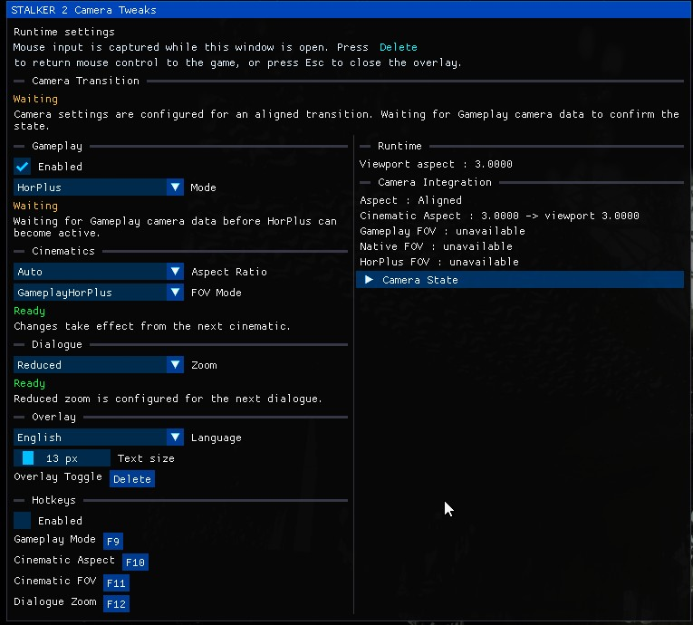
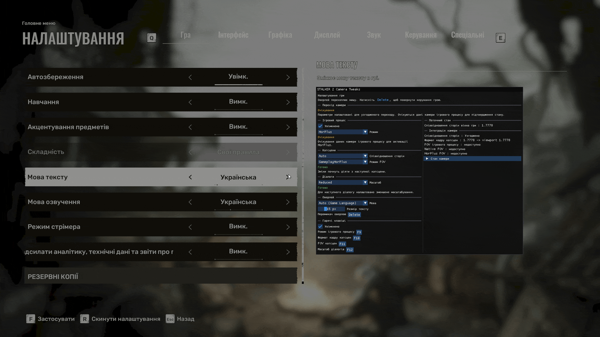

# STALKER 2 Camera Tweaks and Ultrawide for UE 5.5.4

This repository contains `STALKER2CameraTweaks.asi`, a unified camera/FOV and ultrawide mod for **S.T.A.L.K.E.R. 2: Heart of Chornobyl**. It has been exercised in-game on Steam build `2.0.6` with Unreal Engine `5.5.4`; most documented behavior has been checked. The scenarios listed below summarize the recorded coverage.

Camera Tweaks are not limited to ultrawide: camera/FOV options and custom cinematic framing are also available on a standard 16:9 display.

The mod is especially useful if you play with a Gameplay FOV other than the game's default 90°. Whether you use a standard 16:9 display, a 32:9 ultrawide or even an unusual aspect ratio such as 3:1 or 48:9, Gameplay HorPlus uses the FOV selected in the game's settings and adapts it to that aspect ratio. The 16:9, 21:9 and 32:9 choices are cinematic framing presets—not a limit on gameplay aspect ratios.

## Features

- Uses the Gameplay FOV selected in the game's own settings as its baseline—no separate mod FOV value needs to be configured. Aspect-aware correction follows it during gameplay; by default, cinematics also use that value as their baseline while preserving authored FOV changes.
- `Gameplay.Mode` selects `HorPlus` gameplay correction or native `AspectRecalculation`.
- Supports cinematic aspect policies `Auto`, `Native`, `16:9`, `21:9` and `32:9`, independently of the display aspect.
- `Cinematics.FovMode` selects `GameplayHorPlus`, which uses the game-selected FOV as its cinematic baseline, or `NativeHorPlus`, which applies Hor+ to the game's authored cinematic FOV independently of Gameplay FOV.
- Offers FOV-aware Dialogue zoom modes: `Native`, `Adaptive`, `Reduced` and `Disabled`.
- Includes an in-game overlay for settings, runtime status, hotkeys and the read-only Camera State view.
- Ships 18 embedded overlay languages with locale-specific font profiles; `Auto (Game Language)` follows the game's interface language.
- Uses the configured Overlay Toggle (`Delete` by default); `Esc` dismisses the open overlay. Optional mode hotkeys are disabled by default.
- Creates and documents `STALKER2CameraTweaks.ini` automatically; overlay settings are saved there as well.
- Resolves gameplay and cinematic hooks through guarded signatures and fails safely when validation is ambiguous or unsuccessful.

## In-game settings overlay

The overlay brings the mod's settings and runtime status into the game. It includes localized selector help and examples, semantic readiness messages, hotkey rebinding and the read-only Camera State view.

**Overlay overview:** the main runtime settings are shown alongside Camera Integration and Camera State information.

<p align="center"></p>

**Selector documentation:** the HorPlus help and examples show how the game-selected Gameplay FOV adapts to different aspect ratios.

<p align="center"></p>

**Camera State:** read-only runtime camera values include contextual help explaining their meaning and current availability.

<p align="center"></p>

**Localization:** the overlay can switch between its embedded language catalogs in-game.

<p align="center"></p>

## Download and installation

Prebuilt releases and installation instructions are available on [Nexus Mods](https://www.nexusmods.com/stalker2heartofchornobyl/mods/2416).

For manual installation:

1. Install [Ultimate ASI Loader](https://github.com/ThirteenAG/Ultimate-ASI-Loader) as `dsound.dll` in `Stalker2\\Binaries\\Win64`.
2. Remove previous `STALKER2UltrawideFix.asi`, `STALKER2GameplayAspectFix.asi` and their old INI/log files. Do not load old and new ASIs together.
3. Copy `STALKER2CameraTweaks.asi` and `STALKER2CameraTweaks.ini` to the same `Win64` directory.
4. Start the game normally.

The plugin creates `STALKER2CameraTweaks.log` beside the game executable. The startup log includes SHA-256 values for the loaded mod and game executable, which helps verify support reports.

## Configuration

Configure the mod in-game through the overlay. Press `Delete` by default to open or close it; `Esc` dismisses the open overlay. Changes are saved to `STALKER2CameraTweaks.ini`.

The default configuration is:

```ini
[Gameplay]
Enabled=true
Mode=HorPlus

[Cinematics]
AspectRatio=Auto
FovMode=GameplayHorPlus

[Dialogue]
Zoom=Adaptive

[Diagnostics]
Enabled=false

[Overlay]
Language=Auto
ToggleKey=VK_2E

[Hotkeys]
Enabled=false
GameplayCycle=F9
CinematicCycle=F10
CinematicFovCycle=F11
DialogueCycle=F12
```

The generated INI documents each setting's available values and examples. You can edit it manually while the game is closed; restart the game after manual changes.

## Screenshots

32:9 gameplay comparison, default FOV 90:

| Without Fix | Fix Enabled |
| --- | --- |
|  |  |

16:9 baseline, default FOV 90:


## Cinematic framing comparisons

The same cinematic framing policy can be selected independently of the physical display aspect ratio. These examples show `Auto` at 16:9, and forced 16:9, 21:9 and 32:9 framing on a 32:9 display, plus forced 32:9 framing on a 16:9 display.

| Configuration | Example |
| --- | --- |
| `Auto` at 2560x1440 |  |
| Forced `16:9` at 5120x1440 |  |
| Forced `21:9` at 5120x1440 |  |
| Forced `32:9` at 5120x1440 |  |
| Forced `32:9` at 2560x1440 |  |

`GameplayHorPlus` can also use the selected Gameplay FOV as the baseline for cinematics while preserving authored cinematic FOV changes. Custom cinematic framing is available even on a 16:9 display:

<p align="center"></p>

<p align="center"></p>

## Dialogue zoom comparisons

Dialogue zoom is calculated relative to the current gameplay FOV. The comparison images below show the available production policies on a `5120x1440` display.

| Configuration | Example |
| --- | --- |
| `Adaptive` / `Native` at gameplay FOV 90 |  |
| `Reduced` at gameplay FOV 90 |  |
| `Disabled` |  |

`Native` preserves the game's original dialogue zoom, `Adaptive` preserves its optical zoom strength relative to gameplay, `Reduced` applies half of the Adaptive strength, and `Disabled` keeps the gameplay FOV during dialogue.

## Known viewmodel limitation

The game's weapon/viewmodel FOV may remain incorrectly framed after certain cinematics, loads or gameplay-camera rebuilds. Aiming down sights or opening a menu can refresh the game's viewmodel state. This mod does not change that separate viewmodel path. [Weapon Viewmodel FOV](https://www.nexusmods.com/stalker2heartofchornobyl/mods/2422) can be used alongside this mod for a more consistent viewmodel correction and custom weapon FOV settings.

## Animated demonstrations

These recordings show additional runtime behavior of the unified ASI:

| Area | Demonstration |
| --- | --- |
| Gameplay aspect correction |  |
| Cinematic framing and FOV overview |  |
| Dialogue zoom policies |  |

## Tested scope and limitations

- Runtime-tested on Steam game build `2.0.6`; the tested executable identity is recorded in the startup log.
- Static resolver portability was also checked against Steam builds `2.0.2`, `2.0.3`, `2.0.4` and `2.0.5`; these older builds do not have separate runtime validation for this release.
- Gameplay tested at 16:9, 21:9 and 32:9, including startup, hot aspect switching, death/load rebuild and FOV preservation.
- `Auto` cinematics tested through `16:9 → 21:9 → 32:9 → 16:9 → 21:9 → 32:9` without restarting the game.
- Cinematics tested with `Native`, forced `16:9`, forced `21:9` and forced `32:9` policies on `5120x1440`.
- Forced 32:9 framing was also tested at `2560x1440` and correctly produced cinematic letterbox bars.
- `NativeHorPlus` and `GameplayHorPlus` cinematic FOV modes were tested with live F11 switching.
- F9 live switching between `AspectRecalculation` and `HorPlus` was tested without a reload, including ADS and binocular transitions.
- Dialogue coexistence, save/load camera recreation and cinematic EXIT/recovery were tested in the combined runtime session.
- The game retains its native post-cinematic FOV recovery; this release does not force or rewrite that native transition.
- Weapon/viewmodel FOV can remain incorrectly framed after a cinematic, load or gameplay-camera rebuild. This is a separate game-side issue and is not fixed by this mod.
- In windowed mode, a custom resolution whose aspect is not represented by a native game aspect mode may be resized by the game's native `AspectRecalculation` return to `Auto`. This does not mean arbitrary-aspect HorPlus is unsupported.
- Changing the game resolution during a session is validated for `AspectRatio=Auto`; restart the game after changing the configuration file itself.
- Signature resolution improves resilience to address relocation but does not guarantee compatibility with future patches. The plugin fails safely when validation does not pass.

## Build requirements

- Visual Studio 2022 17.14 or newer with the Desktop development with C++ workload and the x64 MSVC tools component.
- The production source uses C++23-era language/library facilities. With the supported MSVC 17.14 toolset, `build.cmd` selects `/std:c++latest` because that compiler exposes the required C++23 feature set through that switch.
- `build.cmd` creates the production `STALKER2CameraTweaks.asi`, including the combined overlay, embedded catalogs/font profiles, and bounded Auto language reader, without high-rate research instrumentation. Its `OVERLAY_PRODUCTION` definition selects the shipped overlay integration.
- `tools/build/build-diagnostic.cmd` creates the separate `STALKER2CameraTweaksDiagnostic.asi` with supported diagnostic instrumentation; it is not intended for performance comparison.
- `tools/build/build-overlay-settings.cmd` is a compatibility alias to `build.cmd`. `tools/build/build-overlay-poc.cmd` and `tools/build/build-overlay-discovery.cmd` are retired standalone research scripts, not supported ASI build profiles. The former still exercises the legacy `OVERLAY_RENDERING_POC` source gate.
- [SafetyHook](https://github.com/cursey/safetyhook), including its bundled Zydis source.
- [spdlog](https://github.com/gabime/spdlog).

Place dependencies under `external/safetyhook`, `external/spdlog`, and `external/imgui`, then run `build.cmd` from this directory. The script discovers the supported Visual Studio installation with `vswhere`; it does not depend on the author's local drive path. Production compilation does not define research/test switches.

## Development and research tools

The following tools were used during development, reverse engineering and validation of this project:

### Production development

- Visual Studio 2022 and MSVC with C++23 support.
- C++23, Windows SDK and PowerShell build/automation scripts.
- SafetyHook for guarded native hooks.
- Zydis for instruction decoding and structural signature validation.
- spdlog for runtime diagnostics and support logs.
- Ultimate ASI Loader for loading the ASI in the game.
- Git for source, research and evidence history.

### Static and runtime research

- Ghidra for executable analysis, callgraph reconstruction and static ownership research.
- UE4SS for reflected runtime inspection, object discovery, function hooks, `.usmap` generation and bounded Lua probes.
- CUE4Parse with .NET 10 for direct UE5 IoStore/Zen package inspection, cooked Blueprint export recovery and Kismet analysis.
- A custom `CUE4ParseWVF` research dumper for the targeted `WVF` and `WVF_Actor` packages.
- Custom UE4SS Lua probes for AnimScriptInstance, WVF lifecycle and `MPC_FOV.TanFOV` causal validation.
- `repak`, `retoc` and `UAssetToolRivals` for exploratory IoStore extraction attempts.
- Oodle runtime/tooling support as part of the UE5 IoStore and asset-tool investigation.

### Evaluated but not used as the final path

- UAssetGUI was considered for traditional `.uasset/.uexp` inspection, but the direct CUE4Parse path made it unnecessary.
- FModel was considered for package discovery, but it was not used as the authoritative WVF analysis path.

The research tools and probes are kept under `research/` and are not part of the production release package.

## License and credits

Original v1.0+ project code is source-available under the terms in [LICENSE.md](LICENSE.md). Contributions and collaboration are welcome. You may study and experiment with the source, create public development forks, collaborate on changes, publish research and signatures, and share experimental builds with collaborators or testers while developing changes, compatibility fixes or contributions.

The main restriction is on publishing modified versions of this Project's protected code as independent public end-user releases without permission. The license does not claim ownership of general ideas, methods or technical knowledge. Work developed independently without copying or adapting protected Project code does not require release permission merely because the Project was used as a technical reference. However, when Covered Work materially contributes as a reference or research source to a publicly released mod, tool or product, its public page must credit Elhait, identify the Project as a source and link to the original Project. If there is no public page, this acknowledgement belongs in the accompanying publicly accessible documentation. This applies to both direct study and AI-assisted use, including context, training and evaluation. See section 5 of [LICENSE.md](LICENSE.md) for the full requirement. Exact unmodified mirrors of official release packages are allowed.

With Elhait's permission, another developer may maintain or continue the Project and publish releases through GitHub. This does not provide access to Elhait's Nexus Mods account or permission to update the existing Nexus Mods page.

This is not an OSI-approved open-source license. Third-party components remain under their own licenses; see [THIRD_PARTY_NOTICES.md](THIRD_PARTY_NOTICES.md).

Additional permission for GSC Game World is described separately in [GSC_DEVELOPER_PERMISSION.md](GSC_DEVELOPER_PERMISSION.md).

BigChenga has separate permission to use Project implementations and solutions directly in WIDEBOY Fixes. Elhait remains responsible for official Project releases, with collaboration and upstream contributions as the intended path. If Elhait permanently stops maintaining or abandons the Project, BigChenga may maintain and publish a clearly attributed continuation. Temporary inactivity or a period without releases does not activate this permission. See [BIGCHENGA_PERMISSION.md](BIGCHENGA_PERMISSION.md).

Versions released before v1.0.0 were published under the MIT License. Those historical grants remain valid and are not revoked by the v1.0+ terms.

Official release channels are this project's GitHub repository and Nexus Mods page. Exact unmodified mirrors of official release packages are permitted. Modified or independently rebuilt packages are not official releases unless they are published under explicit maintainer or continuation permission from Elhait.

Special thanks to Lyall and [STALKER2Tweak](https://github.com/lyall/STALKER2Tweak) for providing an early reference point and inspiration for this project. The project has since grown into its own independent implementation and feature set.

Special thanks to [BigChenga](https://www.nexusmods.com/profile/BigChenga), creator of [WIDEBOY Fixes](https://www.nexusmods.com/stalker2heartofchornobyl/mods/2337), for his original work on ultrawide support and for sharing reverse-engineering references, discoveries and ideas that helped this project along the way.

WIDEBOY Fixes was also used as a research reference for dialogue/camera FOV behavior. The dialogue implementation in this project was independently reverse engineered and runtime validated.

## Contact

For development questions, collaboration, licensing permissions or other project-related inquiries, you can contact me through the links available on my GitHub profile, including LinkedIn.

## Support development

- [Ko-fi](https://ko-fi.com/elhait)
- [Donatello](https://donatello.to/Elhait)
